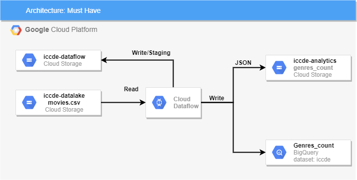
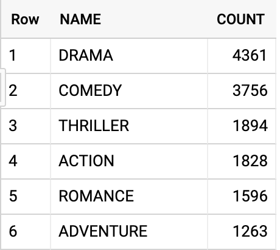
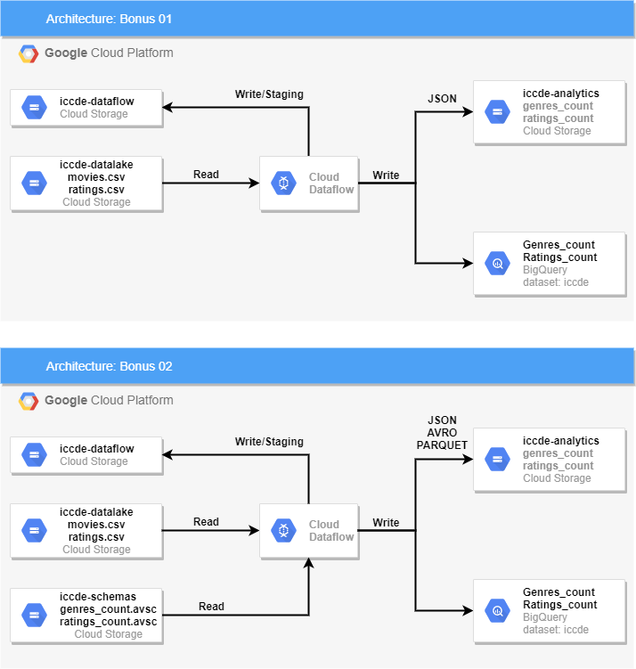

# Desafio - Engenharia de Dados

O desafio consiste em criar um pipeline de processamento de dados e a 
automação de criação dos recursos de infraestrutura.

## Entrega
Você terá 7 dias a partir do recebimento deste email para fazer a 
entrega final via github. Durante todo o período estarei disponível para 
dúvidas, o foco do teste é descobrir como você lida com aprender 
tecnologias que nunca viu antes para fazer uma entrega. Caso não consiga 
terminar 100% do proposto, recomendo que faça as entregas mesmo assim 
para que possamos avaliar seu desempenho.

### Arquivos
Os datasets para testes e schemas Avro estão no diretório resources. 

Os arquivos CSV fazem parte de um dataset público chamado MovieLens.
Para intuito de testes a versão incluída neste pacote é a small. Após 
a conclusão do desenvolvimento você pode baixar a versão completa 
(cerca de 265MB) e realizar os processamentos novamente.

https://grouplens.org/datasets/movielens/latest/

### Requisitos
* Conta na Google Cloud Platform
* Google Cloud SDK
* Terraform > v0.12
* Java 8/Maven 3
* Python 3.7/Pip

## Pipeline
Utilizando o Apache Beam, deverá ser criado um pipeline de processamento
que lerá de um bucket do Storage o arquivo movies.csv, realizar todos os 
parses necessários para obtermos uma contagem de ocorrências de cada 
gênero de filmes.

O resultado final deve ser gravado em uma tabela no BigQuery chamada
genre_count e no Storage em formato JSON.

O pipeline pode ser codificado em Python ou Java 
(melhor ainda nas duas).

### Desenho da solução:

### Exemplo de resultado no BigQuery

## Automação

Utilizando o Terraform/Shellscript/Google Cloud SDK, deverão ser criados 
todos os scripts de provisionamento dos recursos necessários para a 
execução do projeto. São eles:

* Storage (Terraform)
  * iccde-dataflow
  * iccde-datalake
  * iccde-analytics
  * iccde-schemas (bônus)
* BigQuery (Terraform)
  * Dataset iccde
  * Tabela genre_count
    * NAME: STRING
    * COUNT: INTEGER
  * Tabela movie_ratings_count (bônus)
    * NAME: STRING
    * RATING: FLOAT
    * COUNT: INTEGER
* Mover Arquivos (Shellscript/Google Cloud SDK)
  * CSV
    * Bucket iccde-datalake
  * Avro Schemas (bônus)
    * Bucket iccde-schemas
    
## Bônus

Existem dois cenários bônus que, em caso de tempo, podem ser adicionados
ao pipeline original.

O bônus 01 consiste em realizar a contagem de ratings de cada um dos 
filmes e a gravação no Storage/BigQuery.

O bônus 02 consiste em adicionar a validação dos registros gerados em 
um Avro Schema e a gravação no Storage de arquivos nos formatos Avro e 
Parquet (além do JSON).

## Bônus Ops

O terraform que subir infraestrutura do pipelines, deve funcionar de forma modularizado e 
tambem que tenha facilidade de executar destroy nos dataflow sem impactar o Storage e Bigquery,
na execução do script, ele tem que executar usando credenciais default e não service account.

https://cloud.google.com/sdk/gcloud/reference/auth/application-default/login