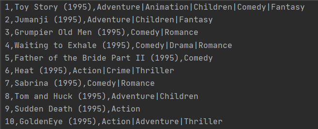
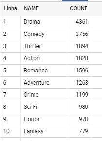
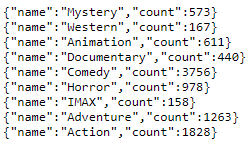
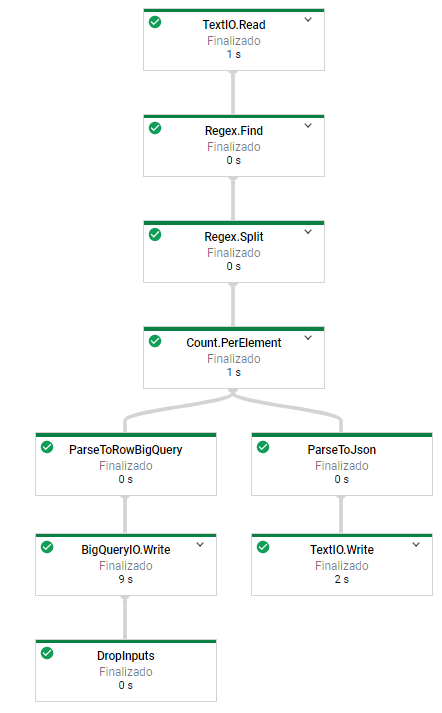

# Desafio - Engenharia de Dados

O desafio consiste em criar um pipeline de processamento de dados e a automação de criação dos recursos de 
infraestrutura.

## Entrega do Desafio

Foi desenvolvido um pipeline de processamento de dados utilizando linguagem Java e a automação de criação dos 
recursos de infraestrutura com o Terraform, Shellscript e o Google Cloud SDK.

## Amostra dos dados de entrada

## Amostra dos resultados no BigQuery

## Amostra dos resultados no Storage no formato Json

## Construção do Pipeline

A solução deste desafio para a criação do pipeline consiste nas seguintes fases.

- Ler o arquivo de dados contido na Cloud Storage no Bucket iccde-datalake:

        Pipeline p = Pipeline.create(options);
        PCollection<String> readFile = p.apply(TextIO.read().from("gs://iccde-datalake/movies.csv"));

- Buscar apenas os nomes dos gêneros de filmes por uma Regex:

        PCollection<String> findGenres = readFile.apply(Regex.find("([A-Za-z|-]+$)|(no genres listed)"));

- Realizar um split por um delimitador ("|"):

        PCollection<String> splitGenres = findGenres.apply(Regex.split("[=|]"));

- Neste ponto os dados estão prontos para contagem dos gêneros de filmes. É efetuada uma contagem dos 
dados por elemento, gerando uma nova coleção de dados com chave e valor, sendo a chave o nome do gênero 
e o valor a quantidade de vezes que este gênero se repete:

        PCollection<KV<String, Long>> genresCount = splitGenres.apply(Count.perElement());

- Transformar a coleção chave e valor em formato Json:

        PCollection<String> json = genresCount.apply("ParseToJson", ParDo.of(new DoFn<KV<String, Long>, String>() {
            @ProcessElement
            public void processElement(ProcessContext context) {
                KV<String, Long> element = context.element();
                try {
                    context.output(new ObjectMapper().writeValueAsString(new Genre(element.getKey(), element.getValue())));
                } catch (IOException ioException) {
                    ioException.printStackTrace();
                }
            }
        }));
        
- Gravar o Json no Cloud Storage no Bucket iccde-analytics:

        json.apply(TextIO.write().to("gs://iccde-analytics/genres_count/movies.json"));

- Transformar a coleção chave e valor no formato de linhas do BigQuery:

        PCollection<TableRow> bqRow = genresCount.apply("ParseToRowBigQuery", ParDo.of(new DoFn<KV<String, Long>, TableRow>() {
            @ProcessElement
            public void processElement(ProcessContext context) {
                KV<String, Long> element = context.element();
                TableRow tableRow = new TableRow();
                tableRow.set(GenreCount.NAME.name(), element.getKey());
                tableRow.set(GenreCount.COUNT.name(), element.getValue());
                context.output(tableRow);
            }
        }));

- Gravar linhas no dataset iccde na tabela genre_count do BigQuery:

        List<TableFieldSchema> fields = new ArrayList<>();
        fields.add(new TableFieldSchema().setName(GenreCount.NAME.name()).setType("STRING"));
        fields.add(new TableFieldSchema().setName(GenreCount.COUNT.name()).setType("INTEGER"));
        TableSchema schema = new TableSchema().setFields(fields);
        
        bqRow.apply(BigQueryIO.writeTableRows()
                .to("data-challenge-2020:iccde.genre_count")
                .withSchema(schema)
                .withWriteDisposition(BigQueryIO.Write.WriteDisposition.WRITE_TRUNCATE)
                .withCreateDisposition(BigQueryIO.Write.CreateDisposition.CREATE_NEVER));
        
        p.run().waitUntilFinish();

#### Data Flow

#### Argumentos para execução Java no DataFlow:

--project=data-challenge-2020 
--tempLocation=gs://iccde-dataflow/temp/ 
--stagingLocation=gs://iccde-dataflow/staging/ 
--runner=DataflowRunner 

## Construção da Automação

#### Terraform

A estrutura dos arquivos:

main.tf (Arquivo de criação dos recursos de infraestrutura)
variables.tf (Arquivo de variáveis)

- Criação dos Storages:

        resource "google_storage_bucket" "dataflow" {
          name = var.bucket-iccde-dataflow
        }
        
        resource "google_storage_bucket" "datalake" {
          name = var.bucket-iccde-datalake
        }
        
        resource "google_storage_bucket" "analytics" {
          name = var.bucket-iccde-analytics
        }

- Criação do dataset no BigQuery:

        resource "google_bigquery_dataset" "dataset" {
          dataset_id = var.bigquery-dataset
        }

- Criação da tabela no BigQuery com schema:

        resource "google_bigquery_table" "default" {
          dataset_id = google_bigquery_dataset.dataset.dataset_id
          table_id = var.bigquery-table
          schema = <<EOF
        [
          {
            "name": "NAME",
            "type": "STRING",
            "mode": "NULLABLE",
            "description": "Movie genres"
          },
          {
            "name": "COUNT",
            "type": "INTEGER",
            "mode": "NULLABLE",
            "description": "Counting genres of films"
          }
        ]
        EOF
        }

#### Shell Script e Google Cloud SDK

Comando para efetuar a cópia do arquivo de entrada dos dados (movies.csv) para dentro do Cloud Storage no Bucket iccde-datalake.

        output=$(gsutil cp ../datasets/movies.csv gs://iccde-datalake)
        echo $output
